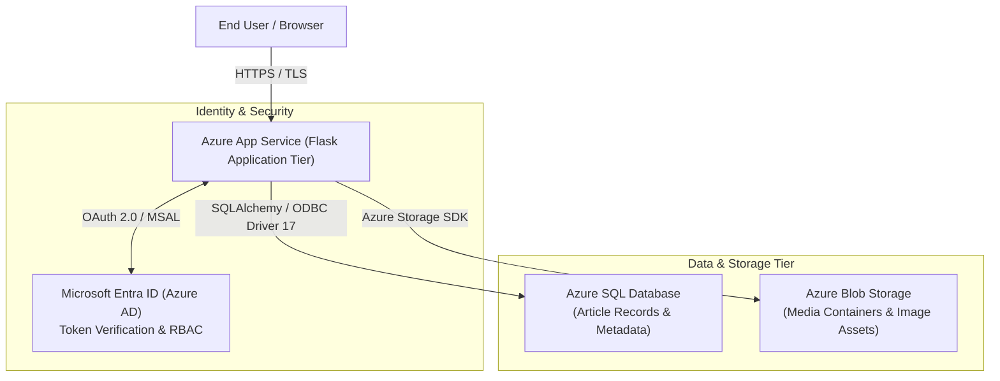
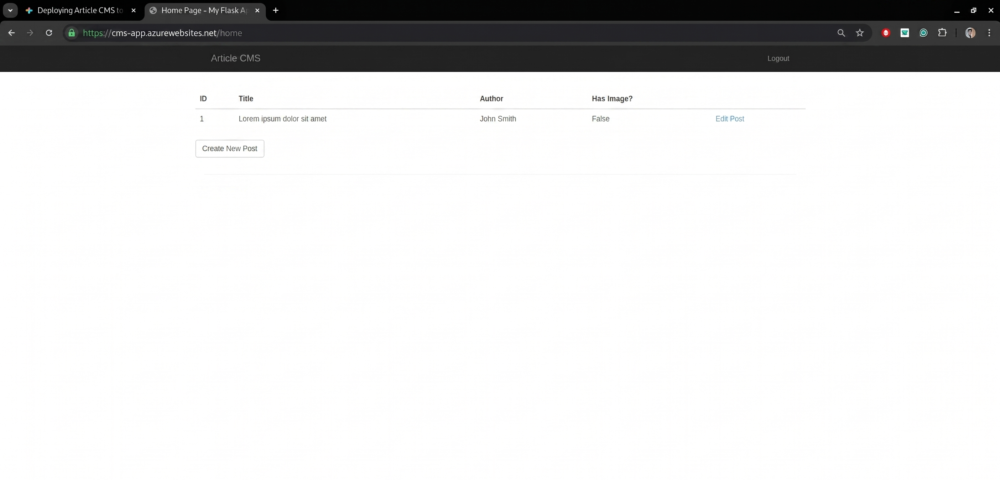
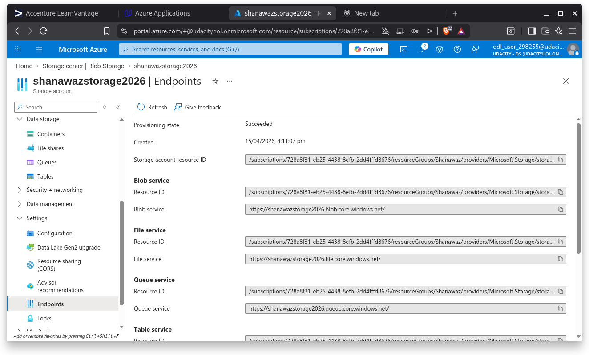
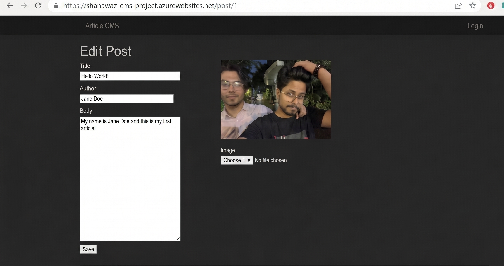
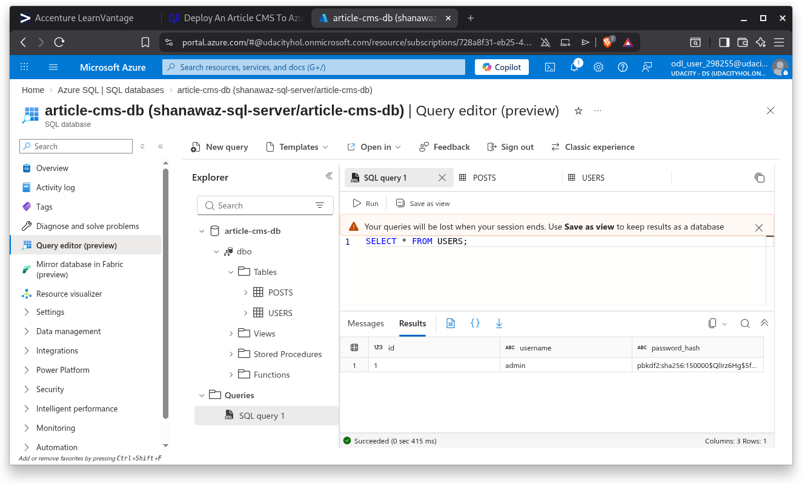
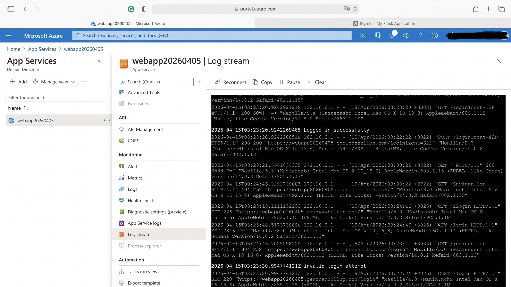
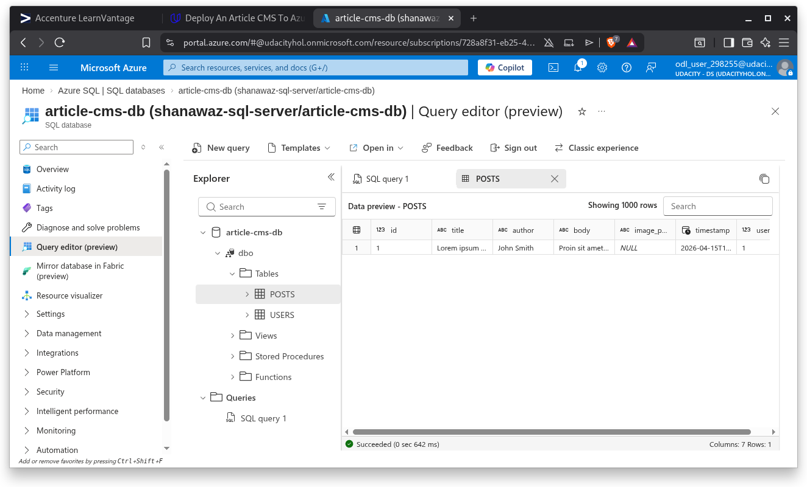

# Azure Cloud CMS: Enterprise Content Management Architecture

<p align="center">
  
  
  
  
  
  
</p>

A cloud-native, enterprise-grade **Content Management System (CMS)** architected on **Microsoft Azure**. The application decouples compute, structured relational data, and unstructured media storage while securing operative access via **Microsoft Entra ID (Azure Active Directory)** OAuth 2.0 authentication.

---

## Architectural Topology



---

## Core Cloud Components

1. **Azure App Service (PaaS)**:
   - Hosts the Python/Flask web tier with automated patching, continuous scaling, and built-in TLS termination.
2. **Azure SQL Database**:
   - Manages relational content, user authorship, timestamps, and article categorization with automated backups and threat detection.
3. **Azure Blob Storage**:
   - High-throughput, decoupled object store for article hero images and media attachments, avoiding local disk saturation on web containers.
4. **Microsoft Entra ID (Azure AD)**:
   - Zero-trust authentication flow implementing OAuth 2.0 / OpenID Connect authorization code grant with PKCE.

---

## Deployment Proof & Infrastructure Evidence

### 1. Azure App Service Live Deployment
Verified production deployment of the Flask Content Management System on Azure App Service with active HTTPS endpoint.



---

### 2. Azure Blob Storage Media Container
Decoupled unstructured object storage container hosting uploaded article hero assets and images.



---

### 3. Azure App Service Linked to Storage
Azure configuration showing direct service integration between the web application tier and Azure Storage Account.



---

### 4. Azure SQL Relational Query Execution
Direct SQL query verification demonstrating relational post metadata and user entity persistence.



---

### 5. Microsoft Entra ID (Azure AD) OAuth Authentication
Successful user authorization code flow completing login using enterprise Microsoft credentials.



---

### 6. Article Publishing & Content Rendering
End-user interface displaying published article content retrieved from Azure SQL paired with hero images loaded from Blob Storage.



---

## PaaS vs. IaaS Deployment Analysis

For full comparative metrics across cost, scalability, availability, and administrative overhead, consult the detailed architectural evaluation in [WRITEUP.md](./WRITEUP.md).

### Summary Justification:
- **Operational Efficiency**: Azure App Service eliminates OS-level maintenance, kernel patch management, and manual reverse proxy configuration.
- **Elastic Scalability**: Automatic horizontal scaling through native scale rules without configuring Virtual Machine Scale Sets (VMSS) or external Load Balancers.
- **Resilience**: Backed by a 99.95% cloud SLA with zero-downtime deployment slots.

---

## Directory Structure

```text
Shanawaz_Azure_CMS_Project/
├── application.py           # Application entrypoint & WSGI handler
├── config.py                # Azure cloud credentials & connection settings
├── requirements.txt         # Production dependencies (Flask, MSAL, pyodbc)
├── FlaskWebProject/         # Modular application code, views, forms, models
│   ├── static/              # Static frontend assets
│   ├── templates/           # Jinja2 presentation templates
│   ├── models.py            # SQLAlchemy data models
│   └── views.py             # Route handlers & OAuth endpoints
├── SqlScripts/              # Database migration & schema DDL scripts
├── screenshots/             # Deployment verification evidence
├── WRITEUP.md               # Detailed PaaS vs. IaaS architectural report
└── README.md                # Project documentation
```

---

## Local Setup & Configuration

### 1. Prerequisites
- Python 3.9+
- ODBC Driver 17 for SQL Server
- Active Azure Subscription

### 2. Environment Configuration
Create a `.env` file or export the required environment variables:
```bash
export SQL_SERVER="<your-sql-server>.database.windows.net"
export SQL_DATABASE="<your-database-name>"
export SQL_USER_NAME="<sql-admin-user>"
export SQL_PASSWORD="<sql-admin-password>"
export BLOB_ACCOUNT="<your-storage-account-name>"
export BLOB_CONTAINER="images"
export CLIENT_ID="<azure-ad-application-id>"
export CLIENT_SECRET="<azure-ad-client-secret>"
export SECRET_KEY="<random-flask-secret-key>"
```

### 3. Run Locally
```bash
python3 -m venv venv
source venv/bin/activate
pip install -r requirements.txt
python application.py
```

---

## License

Developed by Shanawaz Alam for Cloud Architecture & Security Engineering.
